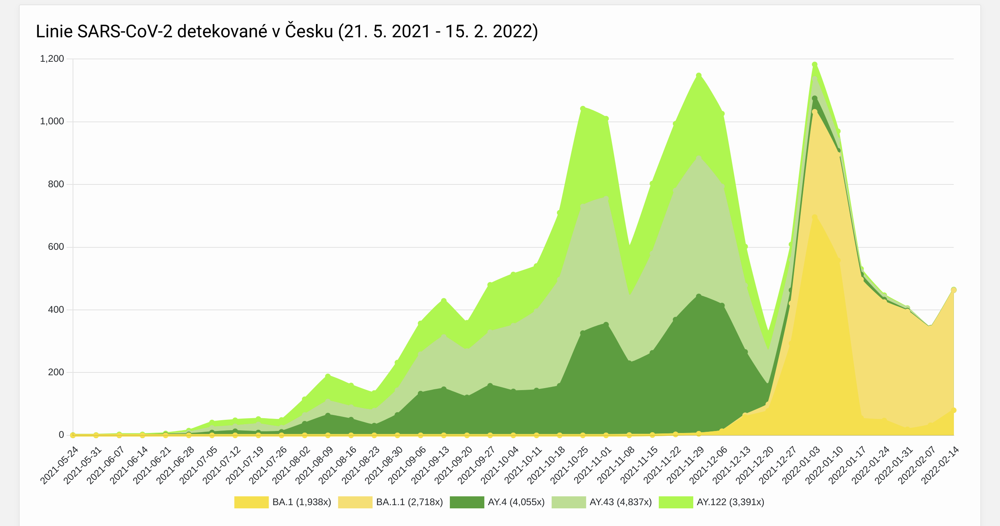

```{r echo=FALSE, message=FALSE}
knitr::opts_chunk$set(comment = NA, echo=FALSE, message = FALSE, warning = FALSE)
options("getSymbols.warning4.0"=FALSE)
```

```{r echo=FALSE}
library(ggplot2)
library(plotly)
library(sqldf)
library(lubridate) # time_length
```

<h1>Virus Sars-Cov-2 v období mezi 21. 5. 2021 a 15. 2. 2022 v České Republice</h1>

<h2>Odhalené mutace viru Sars-Cov-2 ve Všeobecné fakultní nemocnici v Praze (dále VFN) v daném období</h2>
<p>
Cílem následujících grafů je přiblížit dataset se kterým jsem se rozhodl pracovat a určit, zda se zjištěné mutace diskriminačními PCR testy u pozitivních pacientů na virus Sars-Cov-2 v laboratoři mikrobiologie VFN (https://github.com/PRO-OC/pro-oc-mutation-finder-vfn-reports/tree/master/report) a FNB (https://github.com/bulovka/sars-cov-2-mutation-reports/blob/master/report/report) podobají datům z dalších laboratoří na území České Republiky ve stejném časovém období. Oba datasety obsahují data z diskriminačních PCR testů mezi 21.05.2021 a 15.2.2022.
</p>
<h2>Odhalené mutace viru Sars-Cov-2 v dalších laborařích v České Republice v daném období</h2>
<p>
Výsledná data diskriminačních PCR testů dalších laboratoří v České Republice jsou zveřejňovaná v pravidelných reportech Národní referenční laboratoří pro chřipku a respirační onemocnění (dále NLR). Oba datasety jsou subsetem těchto celorepublikových dat. (http://www.szu.cz/tema/prevence/celogenomova-sekvenace-v-cr-souhrnna-zprava?highlightWords=sars-cov-2)
</p>
<h2>Odhalené mutace viru Sars-Cov-2 v rámci projektu celogenomového sekvenování v České Republice v daném období</h2>
<p>
Dalším zdrojem dat je projekt celogenomově sekvenovaných vzorků Akademií věd České Republiky (dále AV ČR) a spolupracujících laboratoří (https://virus.img.cas.cz/lineages) se zadaným časovým obdobím mezi 21. 5. 2021 a 15. 2. 2022, ztotožňujícím se tak s časovým obdobím u dat z konkrétních laboratoří VFN a FNB. Pro zobrazení jednotlivých linií byl vyžadovaný minimální 5% podíl z celku. Projekt AV ČR si kladl za cíl v ideálním případě celogenomově osekvenovat 1% pozitivních vzorků v ČR a AV ČR tak spolu se spolupracujícími laboratoři suplovali nedostatečné kapacity k celogenomovému sekvenování NRL.
</p>
<h2>Shrnutí zdrojů dat</h2>
<p>
Jedná se tedy buď o shrnutí výsledků testovaných mutací diskriminačními PCR testy, porovnání s doporučeními jaké mutace testovat, které vydávalo NRL v pravidelných reportech, a nebo porovnání s celogenomově sekvenovanými daty pozitivních pacientů se všemi potvrzenými mutacemi.
Data z VFN ani data z Bulovky nejsou subsetem celogenomově sekvenovaných dat, protože VFN ani Bulovka tyto vzorky dále celogenomově nesekvenovala a ani je neposílala k dalšímu sekvenování jinam a nepřispívala tak s nimi do projektu. Oba datasety ale jsou jak již bylo zmíněno subsetem celorepublikových dat z diskriminačních PCR testů zveřejňovaných v reportech NRL. Nutno podotknout, že laboratoře navzájem svoje výsledky nevidí.
</p>

<h1>Jednotlivé zdroje dat podrobněji</h1>

<h2>Odhalené varianty v ČR v daném období z projektu virus AV ČR</h2>


<p>
Jak je vidět z grafu (upozornění k typu grafu: nedochází k překrývání! graf není vrstevnatý), tak varianty, které se za dané období na území České Republiky vyskytovaly podle celogenomově sekvenovaných vzorcích byly BA a AY a jejich podvarianty. Konkrétně AY.4, AY.43 a AY.122 s pozvolným vzestupem od začátku časového období (21. 5. 2021) a špičkou a náhlým poklesem na pomezí listopadu a prosince a poté BA.1 a BA1.1 s mírným nástupem od začátku prosince 2021 s razantním nárustem na přelomu roku. BA varianta je známá pod WHO názvem Omikron a AY pod WHO názvem Delta (https://www.who.int/en/activities/tracking-SARS-CoV-2-variants).
</p>

<h2>Diskriminační testy ostatních laboratoří v ČR</h2>

<p>
Report dat diskriminačních PCR testů NLR v ČR mezi 25.12.2021 a 3.1.2022 říká, že 84% vzorků bylo označeno jako varianta Delta a obsahovalo mutaci L452R a odhadem 15% Omikron definovaný mutací K417, N501Y, del69_70 nebo Y505H. Report dat diskriminačních testů v České Republice za další období, tj. od 2. 1. do 9. 1. 2022 už ukazuje nárust Omikronu, mutace L452R byla ve vzorcích v 61% a kolem 40% Omikron a v následujícícm období od 9. 1. do 16. 1. 2022 už Omikron převažoval, zmíněné mutace Omikronu měly 72% a Delty 21,13% a v následujícím Omikron již dominoval 95%. (http://www.szu.cz/tema/prevence/celogenomova-sekvenace-v-cr-souhrnna-zprava?highlightWords=sars-cov-2) 
</p>

```{r, fig.width=8, fig.height=8, comment = NA, echo=FALSE, message = FALSE, warning = FALSE}

# některé mutace byly testované, ale nebyly potvrzené, je potřeba je z datasetu vyloučit
data = read.csv.sql("vfn_report.csv", "select * from file where Vysledek_mutace = 'Pozitivní'", sep=",")

p<-ggplot(
  data,
  aes(x=as.Date(Datum, format="%d.%m.%Y"), group_by=Nazev_mutace, color=Nazev_mutace)) +
  ggtitle("Všeobecná fakultní nemocnice (VFN)") +
  geom_line(stat = "count", size=1) +
  xlab("Datum (od 21.05.2021 do 15.2.2022)") +
  ylab("Počet testování určité mutace\n s pozitivním výsledkem")
ggplotly(p)
```
```{r, fig.width=8, fig.height=8, comment = NA, echo=FALSE, message = FALSE, warning = FALSE}

# některé mutace byly testované, ale nebyly potvrzené, je potřeba je z datasetu vyloučit
data = read.csv.sql("bulovka_report.csv", sql=c("select * from file where Vysledek_mutace = 'Pozitivní'"), sep=",")

p<-ggplot(
  data,
  aes(x=as.Date(Datum, format="%d.%m.%Y"), group_by=Nazev_mutace, color=Nazev_mutace)) +
  ggtitle("Fakultní nemocnice Bulovka (FNB)") +
  geom_line(stat = "count", size=1) +
  xlab("Datum (od 21.05.2021 do 15.2.2022)") +
  ylab("Počet testování určité mutace\n s pozitivním výsledkem")
ggplotly(p)
```

<h2>Zhodnocení<h2>
<p>
Oba datasety z VFN a FNB by podle celogenomově sekvenovaných vzorků z daného období v České Republice a přiřazených variant a výsledků diskriminačních testů dalších laboratoří měly obsahovat následující mutace: L452R, P681R a Del69-70, E484K, K417N, K417T, Y505H.
</p>
<h3>VFN</h3>
<p>
Mutace L452 se v daném období potvrzuje také v grafu u vzorků testovaných ve VFN. Kromě ní byla ještě ve velké míře pozitivně testovaná i mutace P681R, kterou NRL v reportech neuvádí, je ale jako druhá Mutation of interest (MOI) spjatá s variantou Delta spolu s L452R podle outbreak.info. (https://outbreak.info/compare-lineages?pango=AY.4&pango=AY.43&pango=AY.122&gene=ORF1a&gene=ORF1b&gene=S&threshold=90&nthresh=1&sub=false&dark=false)
</p>
<p>
Porovnat zlom z Delty na Omikron pacientů pozitivně testovaných ve VFN se zbytkem republiky porovnat bohužel nejde, protože reporty NRL neuvádějí přesná data vzorků, pouze rozmezí týdne na jehož konci uvádějí vyjádření v % a ve VFN datech se ve zlomovém období prosinec neprováděli diskriminační testy vůbec a na začátek měsíce ledna jich připadá minimální množství.
</p>
<h3>Bulovka</h3>
FNB začala mutaci K452R testovat až s potvrzených příchodem varianty Omikron NRL na přelomu roku 2021 a 2022.
<p>
Porovnat zlom z Delty na Omikron pacientů pozitivně testovaných ve VFN se zbytkem republiky porovnat tedy bohužel také nejde z důvodu týdenních reportů.
</p>

<p>
Následuje graf, který ukazuje testované, ale neprokázané mutace. Z něho vyplývá, že laboratoř mikrobiologie VFN i FNB dále nějakou dobu po avizovaném příchodu Omikronu pokračovaly s testováním na přítomnost mutace L452 varianty Delta jak bylo doporučováno NRL, mutace se stále více nepotvrzovala a z toho vyplývá, že byla varianta Delta jak bylo zmíněno výše již v populaci ČR tak i u pacientů zachycených VFN a FNB nahrazována novou nakažlivější varintou Omikron, která tuto mutaci již neobsahuje. V tomto časovém období také obě laboratoře začaly testovat na přítomnost mutace A570D, která byla diskriminačními testy jiných laboratoří potvrzována jako pozitivní řádově v 1-2% od začátku vytyčeného období kdy ke konci podzimu se nedostala v reportech ani jednou nad 1% a s nástupem Omikronu vymizela úplně. Tato mutace patřící variantě britské (alfa) a nebyla ve VFN a FNB potvrzena v lednu v žádném z případů a neobjevením této mutace v tomto menším počtu testovaných vzorků na ní tak laboratoře přispěly k potvrzení, že došlo na vymícení britské (alfa) varianty v České Republice.
Laboratoř FNB na rozdíl od VFN ještě v srpnu testovala vícekrát na mutaci W152C (a výjimečně u složiteého případu na pomezí roku 2021 a 2022), která patřila variantě Epsilon ale později již ne variantě Delta. Negativní vyloučení mutace W152C, ale potvrzení L452R tak znamenalo, že jde již o variantu Delta. Obě varianty Delta a Omikron zastřešoval společný název B.1.X.X. Tato varianta Elpsilon není na začátku v celogenomových datech pro vytyčené období zmíněná, protože nedosahovala 5% a týkala se především předchozího roku 2020.
</p>

```{r, fig.width=8, fig.height=8, comment = NA, echo=FALSE, message = FALSE, warning = FALSE}

# tentokrát chceme zobrazit ty mutace, které byly testované, ale nebyly potvrzené
data = read.csv.sql("vfn_report.csv", "select * from file where Vysledek_mutace = 'Negativní'", sep=",")

p<-ggplot(
  data,
  aes(x=as.Date(Datum, format="%d.%m.%Y"), group_by=Nazev_mutace, color=Nazev_mutace)) +
  ggtitle("Všeobecná fakultní nemocnice (VFN)") +
  geom_line(stat = "count", size=1) +
  xlab("Datum (od 21.05.2021 do 15.2.2022)") +
  ylab("Počet testování určité mutace\n s negativním výsledkem")
ggplotly(p)
```
```{r, fig.width=8, fig.height=8, comment = NA, echo=FALSE, message = FALSE, warning = FALSE}

# tentokrát chceme zobrazit ty mutace, které byly testované, ale nebyly potvrzené
data = read.csv.sql("bulovka_report.csv", "select * from file where Vysledek_mutace = 'Negativní'", sep=",")

p<-ggplot(
  data,
  aes(x=as.Date(Datum, format="%d.%m.%Y"), group_by=Nazev_mutace, color=Nazev_mutace)) +
  ggtitle("Fakultní nemocnice Bulovka (FNB)") +
  geom_line(stat = "count", size=1) +
  xlab("Datum (od 21.05.2021 do 15.2.2022)") +
  ylab("Počet testování určité mutace\n s negativním výsledkem")
ggplotly(p)
```

<h2>Další prozkoumávání datasetů z VFN a FNB<h2>

<p>
Graf níže rozděluje pozitivně testované pacienty dle pohlaví. V reportech NRL rozdělení dle pohlaví chybělo. Další graf zobrazuje věk pozitivně testovaných pacientů na časové ose. Celkově je ve VFN datasetu unikátních žádanek na diskriminační test 273, průměrný věk je 35 let a počet žen 157 (57,5%) a mužů 116 (42,49%). Celkově je ve FNB datasetu unikátních žádanek na diskriminační test 229, průměrný věk je 35 let a počet žen 104 (45,41%) a mužů 125 (54,59%).
</p>

```{r, fig.width=8, fig.height=8, comment = NA, echo=FALSE, message = FALSE, warning = FALSE}

# některé mutace byly testované, ale nebyly potvrzené, je potřeba je z datasetu vyloučit
# navíc je potřeba mít co řádek to unikátní číslo žádanky = pouze jednu osobu, by default může být co řádek to testovaná mutace pro tu stejnou žádanku = osobu třeba 10x
data = read.csv.sql("vfn_report.csv", "select * from file where Vysledek_mutace = 'Pozitivní' group by Cislo_zadanky", sep=",")

nrow(data) # unique patients

data_womans = read.csv.sql("vfn_report.csv", "select * from file where Vysledek_mutace = 'Pozitivní' and Pohlavi = 'žena' group by Cislo_zadanky", sep=",")

nrow(data_womans) # unique patients womans

p<-ggplot(
  data,
  aes(x=as.Date(Datum, format="%d.%m.%Y"), group_by=Pohlavi, color=Pohlavi)) +
  ggtitle("Všeobecná fakultní nemocnice (VFN)") +
  geom_line(stat = "count", size=1) +
  xlab("Datum (od 21.05.2021 do 15.2.2022)") +
  ylab("Počet mužů a žen pozitivně testovaných\n na alespoň jednu mutaci")
ggplotly(p)
```
```{r, fig.width=8, fig.height=8, comment = NA, echo=FALSE, message = FALSE, warning = FALSE}

# některé mutace byly testované, ale nebyly potvrzené, je potřeba je z datasetu vyloučit
# navíc je potřeba mít co řádek to unikátní číslo žádanky = pouze jednu osobu, by default může být co řádek to testovaná mutace pro tu stejnou žádanku = osobu třeba 10x
data = read.csv.sql("bulovka_report.csv", "select * from file where Vysledek_mutace = 'Pozitivní' group by Cislo_zadanky", sep=",")

nrow(data) # unique patients

data_womans = read.csv.sql("bulovka_report.csv", "select * from file where Vysledek_mutace = 'Pozitivní' and Pohlavi = 'žena' group by Cislo_zadanky", sep=",")

nrow(data_womans) # unique patients womans

p<-ggplot(
  data,
  aes(x=as.Date(Datum, format="%d.%m.%Y"), group_by=Pohlavi, color=Pohlavi)) +
  ggtitle("Fakultní nemocnice Bulovka (FNB)") +
  geom_line(stat = "count", size=1) +
  xlab("Datum (od 21.05.2021 do 15.2.2022)") +
  ylab("Počet mužů a žen pozitivně testovaných\n na alespoň jednu mutaci")
ggplotly(p)
```

```{r, fig.width=8, fig.height=8, comment = NA, echo=FALSE, message = FALSE, warning = FALSE}

# některé mutace byly testované, ale nebyly potvrzené, je potřeba je z datasetu vyloučit
# navíc je potřeba mít co řádek to unikátní číslo žádanky = pouze jednu osobu, by default může být co řádek to testovaná mutace pro tu stejnou žádanku = osobu třeba 10x
data = read.csv.sql("vfn_report.csv", "select * from file where Vysledek_mutace = 'Pozitivní' group by Cislo_zadanky", sep=",")

data_woman = mean(round(time_length(difftime(Sys.Date(), as.Date(data$Datum_narozeni, format="%d.%m.%Y")),"years")), na.rm=TRUE)

p<-ggplot(
  data,
  aes(x=as.Date(Datum, format="%d.%m.%Y"), y=round(time_length(difftime(Sys.Date(), as.Date(Datum_narozeni, format="%d.%m.%Y")),"years")))) +
  geom_point() +
  geom_hline(yintercept = mean(round(time_length(difftime(Sys.Date(), as.Date(data$Datum_narozeni, format="%d.%m.%Y")),"years")))) +
  xlab("Datum (od 21.05.2021 do 15.2.2022)") +
  ylab("Věk pacientů s pozitivním výsledkem alespoň na\n přítomnost jedné testované mutace (protínající\n křivka je průměrný věk)")
ggplotly(p)
```
```{r, fig.width=8, fig.height=8, comment = NA, echo=FALSE, message = FALSE, warning = FALSE}

# některé mutace byly testované, ale nebyly potvrzené, je potřeba je z datasetu vyloučit
# navíc je potřeba mít co řádek to unikátní číslo žádanky = pouze jednu osobu, by default může být co řádek to testovaná mutace pro tu stejnou žádanku = osobu třeba 10x
data = read.csv.sql("bulovka_report.csv", "select * from file where Vysledek_mutace = 'Pozitivní' group by Cislo_zadanky", sep=",")

data_woman = mean(round(time_length(difftime(Sys.Date(), as.Date(data$Datum_narozeni, format="%d.%m.%Y")),"years")), na.rm=TRUE)

p<-ggplot(
  data,
  aes(x=as.Date(Datum, format="%d.%m.%Y"), y=round(time_length(difftime(Sys.Date(), as.Date(Datum_narozeni, format="%d.%m.%Y")),"years")))) +
  ggtitle("Fakultní nemocnice Bulovka (FNB)") +
  geom_point() +
  geom_hline(yintercept = mean(round(time_length(difftime(Sys.Date(), as.Date(data$Datum_narozeni, format="%d.%m.%Y")),"years")))) +
  xlab("Datum (od 21.05.2021 do 15.2.2022)") +
  ylab("Věk pacientů s pozitivním výsledkem alespoň na\n přítomnost jedné testované mutace (protínající\n křivka je průměrný věk)")
ggplotly(p)
```

<p>Dále jsem se rozhodl rozdělit vzorek na 2 skupiny dle varianty, tedy Delta a nebo Omikron a tyto skupiny porovnat podle věku a pohlaví, Jako kritéria jsem v datech mohl zvolit posledního pozitivně testovaného pacienta na mutaci L452R (Delta varianta) 29.11.2021 ve VFN, ale udělal jsem to jednodušeji podle roku 2022 a 2021. V prosinci nebyl ve VFN 2021 zadaný do ISINu takřka žádný diskriminační PCR test.
</p>

```{r, fig.width=8, fig.height=8, comment = NA, echo=FALSE, message = FALSE, warning = FALSE}

data_delta = read.csv.sql("vfn_report.csv", "select * from file where Vysledek_mutace = 'Pozitivní' and substr(Datum, -4) < '2022' group by Cislo_zadanky", sep=",")

data_delta_woman = read.csv.sql("vfn_report.csv", "select * from file where Vysledek_mutace = 'Pozitivní' and substr(Datum, -4) < '2022' and Pohlavi = 'žena' group by Cislo_zadanky", sep=",")

nrow(data_delta)
nrow(data_delta_woman)

p<-ggplot(
  data_delta,
  aes(x=as.Date(Datum, format="%d.%m.%Y"), group_by=Pohlavi, color=Pohlavi)) +
  ggtitle("Všeobecná fakultní nemocnice (VFN)") +
  geom_line(stat = "count", size=1) +
  xlab("Datum (od 21.05.2021 do 31.12.2021)") +
  ylab("Počet mužů a žen pozitivně testovaných\n na Deltu")
ggplotly(p)
```

```{r, fig.width=8, fig.height=8, comment = NA, echo=FALSE, message = FALSE, warning = FALSE}

mean(round(time_length(difftime(Sys.Date(), as.Date(data_delta$Datum_narozeni, format="%d.%m.%Y")),"years")), na.rm=TRUE)
# červená křivka je průměr v grafu

median(round(time_length(difftime(Sys.Date(), as.Date(data_delta$Datum_narozeni, format="%d.%m.%Y")),"years")))
# zelená křivka je medián v grafu

p<-ggplot(
  data_delta,
  aes(x=as.Date(Datum, format="%d.%m.%Y"), y=round(time_length(difftime(Sys.Date(), as.Date(Datum_narozeni, format="%d.%m.%Y")),"years")))) +
  ggtitle("Všeobecná fakultní nemocnice (VFN)") +
  geom_point() +
  geom_hline(yintercept = mean(round(time_length(difftime(Sys.Date(), as.Date(data_delta$Datum_narozeni, format="%d.%m.%Y")),"years"))), col=2) +
  geom_hline(yintercept = median(round(time_length(difftime(Sys.Date(), as.Date(data_delta$Datum_narozeni, format="%d.%m.%Y")),"years"))), col=3) +
  xlab("Datum (od 21.05.2021 do 31.12.2021)") +
  ylab("Věk pacientů s pozitivním výsledkem varianty Omikron")
ggplotly(p)
```

```{r, fig.width=8, fig.height=8, comment = NA, echo=FALSE, message = FALSE, warning = FALSE}

data_omikron = read.csv.sql("vfn_report.csv", "select * from file where Vysledek_mutace = 'Pozitivní' and substr(Datum, -4) > '2021' group by Cislo_zadanky", sep=",")

data_omikron_woman = read.csv.sql("vfn_report.csv", "select * from file where Vysledek_mutace = 'Pozitivní' and substr(Datum, -4) > '2021' and Pohlavi = 'žena' group by Cislo_zadanky", sep=",")

nrow(data_omikron)
nrow(data_omikron_woman)

p<-ggplot(
  data_omikron,
  aes(x=as.Date(Datum, format="%d.%m.%Y"), group_by=Pohlavi, color=Pohlavi)) +
  ggtitle("Všeobecná fakultní nemocnice (VFN)") +
  geom_line(stat = "count", size=1) +
  xlab("Datum (od 01.01.2022 do 15.2.2022)") +
  ylab("Počet mužů a žen pozitivně testovaných\n na Omikron")
ggplotly(p)
```


```{r, fig.width=8, fig.height=8, comment = NA, echo=FALSE, message = FALSE, warning = FALSE}

mean(round(time_length(difftime(Sys.Date(), as.Date(data_omikron$Datum_narozeni, format="%d.%m.%Y")),"years")), na.rm=TRUE)
# červená křivka je průměr v grafu

median(round(time_length(difftime(Sys.Date(), as.Date(data_omikron$Datum_narozeni, format="%d.%m.%Y")),"years")))
# zelená křivka je medián v grafu

p<-ggplot(
  data_omikron,
  aes(x=as.Date(Datum, format="%d.%m.%Y"), y=round(time_length(difftime(Sys.Date(), as.Date(Datum_narozeni, format="%d.%m.%Y")),"years")))) +
  ggtitle("Všeobecná fakultní nemocnice (VFN)") +
  geom_point() +
  geom_hline(yintercept = mean(round(time_length(difftime(Sys.Date(), as.Date(data_omikron$Datum_narozeni, format="%d.%m.%Y")),"years"))), col=2) +
  geom_hline(yintercept = median(round(time_length(difftime(Sys.Date(), as.Date(data_omikron$Datum_narozeni, format="%d.%m.%Y")),"years"))), col=3) +
  xlab("Datum (od 01.01.2022 do 15.2.2022)") +
  ylab("Věk pacientů s pozitivním výsledkem varianty Omikron")
ggplotly(p)
```

```{r, fig.width=8, fig.height=8, comment = NA, echo=FALSE, message = FALSE, warning = FALSE}

data_omikron = read.csv.sql("bulovka_report.csv", "select * from file where Vysledek_mutace = 'Pozitivní' and substr(Datum, -4) > '2021' group by Cislo_zadanky", sep=",")

data_omikron_woman = read.csv.sql("bulovka_report.csv", "select * from file where Vysledek_mutace = 'Pozitivní' and substr(Datum, -4) > '2021' and Pohlavi = 'žena' group by Cislo_zadanky", sep=",")

nrow(data_omikron)
nrow(data_omikron_woman)

mean(round(time_length(difftime(Sys.Date(), as.Date(data$Datum_narozeni, format="%d.%m.%Y")),"years")), na.rm=TRUE) # median

p<-ggplot(
  data_omikron,
  aes(x=as.Date(Datum, format="%d.%m.%Y"), group_by=Pohlavi, color=Pohlavi)) +
  ggtitle("Nemocnice Bulovka (FNB)") +
  geom_line(stat = "count", size=1) +
  xlab("Datum (od 01.01.2022 do 15.2.2022)") +
  ylab("Počet mužů a žen pozitivně testovaných\n na Omikron")
ggplotly(p)
```

```{r, fig.width=8, fig.height=8, comment = NA, echo=FALSE, message = FALSE, warning = FALSE}

mean(round(time_length(difftime(Sys.Date(), as.Date(data_omikron$Datum_narozeni, format="%d.%m.%Y")),"years")), na.rm=TRUE)
# červená křivka je průměr v grafu

median(round(time_length(difftime(Sys.Date(), as.Date(data_omikron$Datum_narozeni, format="%d.%m.%Y")),"years")))
# zelená křivka je medián v grafu

p<-ggplot(
  data_omikron,
  aes(x=as.Date(Datum, format="%d.%m.%Y"), y=round(time_length(difftime(Sys.Date(), as.Date(Datum_narozeni, format="%d.%m.%Y")),"years")))) +
  ggtitle("Nemocnice Bulovka (FNB)") +
  geom_point() +
  geom_hline(yintercept = mean(round(time_length(difftime(Sys.Date(), as.Date(data_omikron$Datum_narozeni, format="%d.%m.%Y")),"years"))), col=2) +
  geom_hline(yintercept = median(round(time_length(difftime(Sys.Date(), as.Date(data_omikron$Datum_narozeni, format="%d.%m.%Y")),"years"))), col=3) +
  xlab("Datum (od 01.01.2022 do 15.2.2022)") +
  ylab("Věk pacientů s pozitivním výsledkem varianty Omikron")
ggplotly(p)
```

```{r, fig.width=8, fig.height=8, comment = NA, echo=FALSE, message = FALSE, warning = FALSE}

data_delta = read.csv.sql("bulovka_report.csv", "select * from file where Vysledek_mutace = 'Pozitivní' and substr(Datum, -4) < '2022' group by Cislo_zadanky", sep=",")

data_delta_woman = read.csv.sql("bulovka_report.csv", "select * from file where Vysledek_mutace = 'Pozitivní' and substr(Datum, -4) < '2022' and Pohlavi = 'žena' group by Cislo_zadanky", sep=",")

nrow(data_delta)
nrow(data_delta_woman)

p<-ggplot(
  data_delta,
  aes(x=as.Date(Datum, format="%d.%m.%Y"), group_by=Pohlavi, color=Pohlavi)) +
  ggtitle("Nemocnice Bulovka (FNB)") +
  geom_line(stat = "count", size=1) +
  xlab("Datum (od 21.05.2021 do 31.12.2021)") +
  ylab("Počet mužů a žen pozitivně testovaných\n na Deltu")
ggplotly(p)
```

```{r, fig.width=8, fig.height=8, comment = NA, echo=FALSE, message = FALSE, warning = FALSE}

mean(round(time_length(difftime(Sys.Date(), as.Date(data_delta$Datum_narozeni, format="%d.%m.%Y")),"years")), na.rm=TRUE)
# červená křivka je průměr v grafu

median(round(time_length(difftime(Sys.Date(), as.Date(data_delta$Datum_narozeni, format="%d.%m.%Y")),"years")))
# zelená křivka je medián v grafu

p<-ggplot(
  data_delta,
  aes(x=as.Date(Datum, format="%d.%m.%Y"), y=round(time_length(difftime(Sys.Date(), as.Date(Datum_narozeni, format="%d.%m.%Y")),"years")))) +
  ggtitle("Nemocnice Bulovka (FNB)") +
  geom_point() +
  geom_hline(yintercept = mean(round(time_length(difftime(Sys.Date(), as.Date(data_delta$Datum_narozeni, format="%d.%m.%Y")),"years"))), col=2) +
  geom_hline(yintercept = median(round(time_length(difftime(Sys.Date(), as.Date(data_delta$Datum_narozeni, format="%d.%m.%Y")),"years"))), col=3) +
  xlab("Datum (od 21.05.2021 do 31.12.2021)") +
  ylab("Věk pacientů s pozitivním výsledkem varianty Omikron")
ggplotly(p)
```
<h2>Vyvozené závěry z rozdělení na skupinu Delta a skupinu Omikron<h2>
<p>
Rozdělením pacientů na zmíněné 2 skupiny jsem zjistil, že nakažení pacienti jedné varianty a druhé neměli průměrný věk statisticky významně odlišný. V případě varianty Omikron v období od 01.01.2022 do 15.02.2022 byl průměrný věk zjištěný z dat VFN 35,3 let a v případě Delty od 21. 5. 2021 do 12.12.2021 34,7 let.
Medián 32 v případě Delty a v případě Omikronu 34. U dat z FNB v případě varianty Omikron 33,4 a v případě Delty 35 let.
</p>
<p>
Poměr nakažených žen v případě obou skupin ve VFN, Delta 84 z 141 žen (57 mužů, 40%) a v případě Omikronu 73 z 134 (60 mužů, 44,7%). Ve FNB pro variantu Delta 29 z 77 žen (48 mužů, 62,3%) a Omikron 70 z 157 žen (87 mužů, 55,4%). Po rozdělení na skupiny to vypadá, že častěji vyhledávali VFN ženy pro obě varianty a muži na rozdíl od žen pro obě varianty FNB.
</p>


<h2>Zjištěné závěry<h2>
<p>
V následujících odstavcích se pokusím shrnout zjištěné závěry.
</p>
<p>
VFN v období kdy v České Republice dominovala varianta Delta testovala na přítomnost mutace L452R dle doporučení NRL a jako další mutaci si z více možností, které NRL doporučovala vybrala mutaci pravděpodobně jako jedna z mála laboratoří MOI P681R. Mutace L452R a mutace P681R jsou jako jedinné uváděné webem outbreak.info jako mutations of interest (obávané, nadále jako MOI) pro všechny subvarianty Delty, AY.4, AY.43, AY.122 (https://outbreak.info/compare-lineages?pango=AY.4&pango=AY.43&pango=AY.122&gene=ORF1a&gene=ORF1b&gene=S&threshold=90&nthresh=1&sub=false&dark=false). Laboratoř VFN prováděla u pacientů test na mutaci L452R i po konci vlny Delta a řídila se tak doporučením provádět tento test pro první orientaci, ale s opačným očekáváním na výsledek, protože Omikron tuto mutaci již neobsahuje. Web outbreak.info pro Omikron a jeho subvarianty uvádí jako MOI také P681R (v 99.1% všech sekvencí), S477N a N501Y. Je důležité poznamenat, že touto dobou již měla NLR možnost se opřít o výsledky projektu celogenomově sekvenovaných vzorků AV ČR a spolupracujících institucí, které potvrzovaly příchod Omikronu. NRL šlo tedy o to vydat takové doporučení, které by vyloučilo Deltu (nepotvrzený test mutace L452R) a poté se už pokusit klasifikovat subvariantu Omikronu. Zmíněné MOI P681R měli obě subvarianty Omikronu.
</p>
<p>
Po rozdělení dat z VFN a FNB na pacienty nakažené variantou Delta (období 21.5. 2021 až 31.12.2021) a variantou Omikron (1.1.2022 až 15.2.2022) jsem zjistil, že podíl testovaných mužů a žen u vzorků ve VFN i FNB na přítomnost varianty Delta i Omikron byl statisticky signifikantní (60% žen Deltave VFN a 57,3% žen Omikron ve VFN a 62% mužů Delta ve FNB a 54,3% mužů Omikron ve FNB). Tento nález jsem nemohl vyhodnotit na základě celorepublikových datech NRL, která data diskriminačních PCR testů dalších laboratoří má, ale rozdělení dle pohlaví nezvěřejňuje. Prozatím jsem usoudil, že je možné, že VFN v centru upřednosťnují z nějakého důvodu více ženy (vzdálenost k nemocnici, bližší nemocnice, důvěra v nemocnici..) a FNB z nějakého důvodu více muži. Minimálně Ti, kteří si myslí, že jsou pozitivní. Bavíme se totiž u datech ve kterém nejsou zahrnutí negativně testovaní, tedy Ti, kteří nemocnici také zvolili, ale nemoc Covid-19 jim potvrzená nebyla a tudíž nebyly na DNA vzorku vykonané diskriminační PCR testy pro odhalení konkrétní varianty viru Sars-Cov-2.
</p>
<p>
Výsledek jsem mohl porovnat v ČR pouze na celogenomově sekvenovaných datech projektu https://virus.img.cas.cz/ na kterém rozdělení podle pohlaví vypadá ve stejném časovém období (1.9.2021 až 31.12.2021) viz. obrázky níže. Znovu uvádím, že data, která porovnávám jsou na sobě nezávislá a neměla by se v nich překrývat ani jedna osoba, protože VFN a FNB nebyla tou dobou do projektu zapojená a vzorky dále celogenomově nesekvenovala ani je dále za účelem celogenomového sekvenování do projektu neposílala. Také je potřeba zmínit, že v zobrazení vycházím z určení linie viru projektem virus a konkrétně mě zajímaly linie AY.4, AY.43, AY.122 (vlastní určení linie viru je ale možné, protože projekt dává celogenomově sekvenované vzorky volně k dispozici). Myslím si, že i kdyby projekt dále specifikoval sekvenované vzorky podle zjištěných méně důležitých mutací do více sublinií delty, tak by alespoň jedna z těchto hlavních sublinií porušila pravidlo, ale všechny říkají to samé co data z VFN, ženy mezi pozitivně testovanými na variantu Delta převládají více než muži: Muži: 45.9% a ženy: 54.1%. Vzhledem ale k datům z mikrobiologie ve FNB, které tvrdí opak nejde učinit jednoznačný závěr.
<p>
Pro zpřesnění výsledků by bylo žádoucí disponovat daty včetně pohlaví k diskriminačním testům z více laboratoří, které by byly po ČR nejlépe vybrané náhodně a celkový vzorek by tak obsahoval větší množství náhodně vybraných pozitivně testovaných. Také by bylo dobré stanovit jednotnou % hranici kdy u jednotlivých laboratoří došlo na častější detekci varianty Omikron nebo nejlépe podle potvrzených mutací vybrat jednotlivé pacienty a jejich pohlaví porovnávat. Pro potvrzení nebo vyloučení možného závěru, že muži si více vybírají FNB a ženy VFN by bylo nutné počítat i s negativně otestovanými.
</p>

```{r, fig.width=8, fig.height=8, comment = NA, echo=FALSE, message = FALSE, warning = FALSE}

mens_count <- sum(c(1690, 1973, 1358))
mens_count
womans_count <- c(1996, 2381, 1542)
womans_count
total_count = womans_count + mens_count
total_count
womans_procenta = womans_count / total_count * 100
womans_procenta
mens_procenta = mens_count / total_count * 100
mens_procenta

df3 <- data.frame(supp=rep(c("muži", "ženy"), each=3),
                dose=rep(c("AY.4", "AY.43", "AY.122"), 2),
                len=c(1690, 1973, 1358, 1996, 2381, 1542))

ggplot(df3, aes(x = dose, y = len)) +
  geom_col(aes(color = supp, fill = supp), position = position_dodge(0.8), width = 0.7) +
  scale_color_manual(values = c("#0000ff", "#FF0000"))+
  scale_fill_manual(values = c("#0000ff", "#FF0000"))
```

```{r, fig.width=8, fig.height=8, comment = NA, echo=FALSE, message = FALSE, warning = FALSE}

mens_count <- sum(c(1690, 1973, 1358))
mens_count
womans_count <- c(1996, 2381, 1542)
womans_count
total_count = womans_count + mens_count
total_count
womans_procenta = womans_count / total_count * 100
womans_procenta
mens_procenta = mens_count / total_count * 100
mens_procenta

df3 <- data.frame(supp=rep(c("muži", "ženy"), each=3),
                dose=rep(c("AY.4", "AY.43", "AY.122"), 2),
                len=c(1690, 1973, 1358, 1996, 2381, 1542))

ggplot(df3, aes(x = dose, y = len)) +
  geom_col(aes(color = supp, fill = supp), position = position_dodge(0.8), width = 0.7) +
  scale_color_manual(values = c("#0000ff", "#FF0000"))+
  scale_fill_manual(values = c("#0000ff", "#FF0000"))
```
</p>