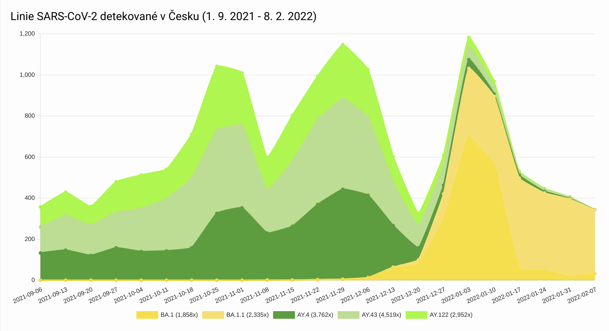

```{r echo=FALSE, message=FALSE}
knitr::opts_chunk$set(comment = NA, echo=FALSE, message = FALSE, warning = FALSE)
options("getSymbols.warning4.0"=FALSE)
```

```{r echo=FALSE}
library(ggplot2)
library(plotly)
library(sqldf)
library(lubridate) # time_length
```

<h1>Virus Sars-Cov-2 v období mezi 1. 9. 2021 a 8. 2. 2022 v České Republice</h1>

<h2>Odhalené mutace viru Sars-Cov-2 ve Všeobecné fakultní nemocnici v Praze (dále VFN) v daném období</h2>
<p>
Cílem následujících grafů je přiblížit dataset se kterým jsem se rozhodl pracovat a určit, zda se zjištěné mutace diskriminačními PCR testy u pozitivních pacientů na virus Sars-Cov-2 v laboratoři mikrobiologie VFN (zhttps://github.com/PRO-OC/pro-oc-mutation-finder-vfn-reports/tree/master/report) podobají datům z dalších laboratoří na území České Republiky ve stejném časovém období. 
</p>
<h2>Odhalené mutace viru Sars-Cov-2 v dalších laborařích v České Republice v daném období</h2>
<p>
Výsledná data diskriminačních PCR testů dalších laboratoří v České Republice jsou zveřejňovaná v pravidelných reportech Národní referenční laboratoří pro chřipku a respirační onemocnění (dále NLR). Data VFN jsou subsetem těchto celorepublikových dat. (http://www.szu.cz/tema/prevence/celogenomova-sekvenace-v-cr-souhrnna-zprava?highlightWords=sars-cov-2)
</p>
<h2>Odhalené mutace viru Sars-Cov-2 v rámci projektu celogenomového sekvenování v České Republice v daném období</h2>
<p>
Dalším zdrojem dat je projekt celogenomově osekvenovaných vzorků Akademií věd České Republiky (dále AV ČR) a spolupracujících laboratoří (https://virus.img.cas.cz/lineages se zadaným časovým obdobím od 1. 9. 2021 až 8. 2. 2022). Projekt si klade za cíl v ideálním případě celogenomově osekvenovat 1% pozitivních vzorků v ČR a AV ČR tak spolu se spolupracujícími laboratoři podporuje nedostatečné kapacity k celogenomovému sekvenování NRL.
</p>
<h2>Shrnutí zdrojů dat</h2>
<p>
Jedná se tedy buď o výsledky testovaných mutací diskriminačními PCR testy, doporučení jaké mutace testovat vydává NRL v těch samých reportech, a nebo celogenomově sekvenovaná data pozitivních pacientů se všemi mutacemi.
VFN data nejsou subsetem celogenomově sekvenovaných dat, protože VFN tyto vzorky dále celogenomově nesekvenovala a ani je neposílala k dalšímu sekvenování jinam a nepřispívala tak s nimi do projektu. VFN data jsou ale subsetem celorepublikových dat diskriminačních PCR testů zveřejňovaných v reportech NRL. (laboratoře navzájem svoje výsledky nevidí)
</p>

<h1>Jednotlivé zdroje dat podrobněji</h1>

<h2>Odhalené varianty v ČR v daném období z projektu virus AV ČR</h2>



<p>
Jak je vidět z grafu ze stránek projektu, tak varianty které se za dané období na území České Republiky vyskytovaly v celogenomově sekvenovaných vzorcích byly BA a AY a jejich podvarianty. Konkrétně AY.4, AY.43 a AY.122 s pozvolným vzestupem od začátku časového období (1.9.2021) a špičkou a náhlým poklesem na pomezí listopadu a prosince a poté BA.1 a BA1.1 s mírným nástupem od začátku prosince 2021 s razantním nárustem na přelomu roku. BA varianta je znává pod WHO názvem Omikron a AY pod WHO názvem Delta (https://www.who.int/en/activities/tracking-SARS-CoV-2-variants).
</p>

<h2>Diskriminační testy ostatních laboratoří v ČR</h2>

<p>
Report dat diskriminačních PCR testů NLR v ČR mezi 25.12.2022 a 3.1.2022 říká, že 84% vzorků bylo označeno jako varianta Delta a obsahovalo mutaci L452R a odhadem 15% Omikron definovaný mutací K417, N501Y, del69_70 nebo Y505H. Report dat diskriminačních testů v České Republice za další období, tj. od 2. 1. do 9. 1. 2022
už ukazuje nárust Omikronu, mutace L452R byla ve vzorcích v 61% a kolem 40% Omikron a v následujícícm období od 9. 1. do 16. 1. 2022 už Omikron převažoval, zmíněné mutace měli 72% a Delta 21,13% a v následujícím Omikron dominoval 95%. (http://www.szu.cz/tema/prevence/celogenomova-sekvenace-v-cr-souhrnna-zprava?highlightWords=sars-cov-2) 
</p>

```{r, fig.width=8, fig.height=8, comment = NA, echo=FALSE, message = FALSE, warning = FALSE}

# některé mutace byly testované, ale nebyly potvrzené, je potřeba je z datasetu vyloučit
data = read.csv.sql("vfn_report.csv", "select * from file where Vysledek_mutace = 'Pozitivní'", sep=",")

p<-ggplot(
  data,
  aes(x=as.Date(Datum, format="%d.%m.%Y"), group_by=Nazev_mutace, color=Nazev_mutace)) +
  geom_line(stat = "count", size=1) +
  xlab("Datum (od 01.09.2021 do 08.02.2022)") +
  ylab("Počet testování určité mutace\n s pozitivním výsledkem")
ggplotly(p)
```
<h2>Zhodnocení<h2>
<p>
  Data z laboratoře mikrobiologie VFN by podle celogenomově sekvenovaných vzorků z daného období v České Republice a přiřazených variant měly obsahovat následující mutace: L452R, P681R a Del69-70, E484K, K417N, K417T, Y505H.
</p>
<p>
Mutace L452 se v daném období potvrzuje také v grafu u pacientů VFN. Kromě ní byla ještě ve velké míře pozitivně testovaná i mutace P681R, kterou NRL v reportech neuvádí, je spjatá s variantou Delta.
</p>
<p>
Zlom z Delty na Omikron pacientů pozitivně testovaných ve VFN se zbytkem republiky porovnat bohužel nejde, protože reporty NRL neuvádějí přesná data vzorků, pouze rozmezí týdne na jehož konci uvádějí vyjádření v % a ve VFN datech se v tomto období neprováděli diskriminační testy vůbec. 
</p>

<p>
Následuje graf, který ukazuje testované, ale neprokázané mutace. Z něho vyplývá, že laboratoř mikrobiologie VFN dále nějakou dobu pokračovala na testování na přítomnost mutace L452 varianty Delta jak bylo doporučováno NRL, mutace se již ale nepotvrzovala a z toho vyplývá, že byla varianta Delta jak bylo zmíněno výše již v populaci ČR nahrazována novou nakažlivější varintou Omikron, která tuto mutaci již neobsahuje a to dříve v Praze než zbylých částech České Republiky. V tomto časovém období laboratoř začala také testovat mutaci A570D, která ale nebyla potvrzená v žádném z případů a která náležela dřívější tzv. Britské variantě. Návrat Britské varianty se tak nepotvrdil.
</p>

```{r, fig.width=8, fig.height=8, comment = NA, echo=FALSE, message = FALSE, warning = FALSE}

# tentokrát chceme zobrazit ty mutace, které byly testované, ale nebyly potvrzené
data = read.csv.sql("vfn_report.csv", "select * from file where Vysledek_mutace = 'Negativní'", sep=",")

p<-ggplot(
  data,
  aes(x=as.Date(Datum, format="%d.%m.%Y"), group_by=Nazev_mutace, color=Nazev_mutace)) +
  geom_line(stat = "count", size=1) +
  xlab("Datum (od 01.09.2021 do 08.02.2022)") +
  ylab("Počet testování určité mutace\n s negativním výsledkem")
ggplotly(p)
```

<h2>Další prozkoumávání data setu z VFN<h2>

<p>
Graf níže rozděluje pozitivně testované pacienty dle pohlaví. V reportech NRL rozdělení dle pohlaví chybělo. Další graf zobrazuje věk pozitivně testovaných pacientů na časové ose. Celkově je v datasetu unikátních žádanek na diskriminační test 273, průměrný věk je 35 let, žen 157 (57,5%), mužů 116 (42,49%).
</p>

```{r, fig.width=8, fig.height=8, comment = NA, echo=FALSE, message = FALSE, warning = FALSE}

# některé mutace byly testované, ale nebyly potvrzené, je potřeba je z datasetu vyloučit
# navíc je potřeba mít co řádek to unikátní číslo žádanky = pouze jednu osobu, by default může být co řádek to testovaná mutace pro tu stejnou žádanku = osobu třeba 10x
data = read.csv.sql("vfn_report.csv", "select * from file where Vysledek_mutace = 'Pozitivní' group by Cislo_zadanky", sep=",")

nrow(data) # unique patients

data_womans = read.csv.sql("vfn_report.csv", "select * from file where Vysledek_mutace = 'Pozitivní' and Pohlavi = 'žena' group by Cislo_zadanky", sep=",")

nrow(data_womans) # unique patients womans

p<-ggplot(
  data,
  aes(x=as.Date(Datum, format="%d.%m.%Y"), group_by=Pohlavi, color=Pohlavi)) +
  geom_line(stat = "count", size=1) +
  xlab("Datum (od 01.09.2021 do 08.02.2022)") +
  ylab("Počet mužů a žen pozitivně testovaných\n na alespoň jednu mutaci")
ggplotly(p)
```


```{r, fig.width=8, fig.height=8, comment = NA, echo=FALSE, message = FALSE, warning = FALSE}

# některé mutace byly testované, ale nebyly potvrzené, je potřeba je z datasetu vyloučit
# navíc je potřeba mít co řádek to unikátní číslo žádanky = pouze jednu osobu, by default může být co řádek to testovaná mutace pro tu stejnou žádanku = osobu třeba 10x
data = read.csv.sql("vfn_report.csv", "select * from file where Vysledek_mutace = 'Pozitivní' group by Cislo_zadanky", sep=",")

data_woman = mean(round(time_length(difftime(Sys.Date(), as.Date(data$Datum_narozeni, format="%d.%m.%Y")),"years")), na.rm=TRUE)

p<-ggplot(
  data,
  aes(x=as.Date(Datum, format="%d.%m.%Y"), y=round(time_length(difftime(Sys.Date(), as.Date(Datum_narozeni, format="%d.%m.%Y")),"years")))) +
  geom_point() +
  geom_hline(yintercept = mean(round(time_length(difftime(Sys.Date(), as.Date(data$Datum_narozeni, format="%d.%m.%Y")),"years")))) +
  xlab("Datum (od 01.09.2021 do 08.02.2022)") +
  ylab("Věk pacientů s pozitivním výsledkem alespoň na přítomnost\n jedné testované mutace (protínající křivka je průměrný věk)")
ggplotly(p)
```

<p>Dále jsem se rozhodl rozdělit vzorek na 2 skupiny dle varianty, tedy Delta a nebo Omikron a tyto skupiny porovnat podle věku a pohlaví, Jako kritéria jsem v datech mohl zvolit posledního pozitivně testovaného pacienta na mutaci L452R (Delta varianta) 29.11.2021, ale udělal jsem to jednodušeji podle roku 2022 a 2021. V prosinci 2021 nebyl ve VFN zadaný do ISINu takřka žádný diskriminační test.
</p>

```{r, fig.width=8, fig.height=8, comment = NA, echo=FALSE, message = FALSE, warning = FALSE}

data_delta = read.csv.sql("vfn_report.csv", "select * from file where Vysledek_mutace = 'Pozitivní' and substr(Datum, -4) < '2022' group by Cislo_zadanky", sep=",")

data_delta_woman = read.csv.sql("vfn_report.csv", "select * from file where Vysledek_mutace = 'Pozitivní' and substr(Datum, -4) < '2022' and Pohlavi = 'žena' group by Cislo_zadanky", sep=",")

nrow(data_delta)
nrow(data_delta_woman)

p<-ggplot(
  data_delta,
  aes(x=as.Date(Datum, format="%d.%m.%Y"), group_by=Pohlavi, color=Pohlavi)) +
  geom_line(stat = "count", size=1) +
  xlab("Datum (od 01.09.2021 do 31.12.2021)") +
  ylab("Počet mužů a žen pozitivně testovaných\n na Deltu")
ggplotly(p)
```

```{r, fig.width=8, fig.height=8, comment = NA, echo=FALSE, message = FALSE, warning = FALSE}

data_omikron = read.csv.sql("vfn_report.csv", "select * from file where Vysledek_mutace = 'Pozitivní' and substr(Datum, -4) > '2021' group by Cislo_zadanky", sep=",")

data_omikron_woman = read.csv.sql("vfn_report.csv", "select * from file where Vysledek_mutace = 'Pozitivní' and substr(Datum, -4) > '2021' and Pohlavi = 'žena' group by Cislo_zadanky", sep=",")

nrow(data_omikron)
nrow(data_omikron_woman)

mean(round(time_length(difftime(Sys.Date(), as.Date(data$Datum_narozeni, format="%d.%m.%Y")),"years")), na.rm=TRUE)

p<-ggplot(
  data_omikron,
  aes(x=as.Date(Datum, format="%d.%m.%Y"), group_by=Pohlavi, color=Pohlavi)) +
  geom_line(stat = "count", size=1) +
  xlab("Datum (od 01.01.2022 do 08.02.2022)") +
  ylab("Počet mužů a žen pozitivně testovaných\n na Omikron")
ggplotly(p)
```

```{r, fig.width=8, fig.height=8, comment = NA, echo=FALSE, message = FALSE, warning = FALSE}

mean(round(time_length(difftime(Sys.Date(), as.Date(data_omikron$Datum_narozeni, format="%d.%m.%Y")),"years")), na.rm=TRUE)
# červená křivka je průměr v grafu

median(round(time_length(difftime(Sys.Date(), as.Date(data_omikron$Datum_narozeni, format="%d.%m.%Y")),"years")))
# zelená křivka je medián v grafu

p<-ggplot(
  data_omikron,
  aes(x=as.Date(Datum, format="%d.%m.%Y"), y=round(time_length(difftime(Sys.Date(), as.Date(Datum_narozeni, format="%d.%m.%Y")),"years")))) +
  geom_point() +
  geom_hline(yintercept = mean(round(time_length(difftime(Sys.Date(), as.Date(data_omikron$Datum_narozeni, format="%d.%m.%Y")),"years"))), col=2) +
  geom_hline(yintercept = median(round(time_length(difftime(Sys.Date(), as.Date(data_omikron$Datum_narozeni, format="%d.%m.%Y")),"years"))), col=3) +
  xlab("Datum (od 01.01.2022 do 08.02.2022)") +
  ylab("Věk pacientů s pozitivním výsledkem varianty Omikron")
ggplotly(p)
```

```{r, fig.width=8, fig.height=8, comment = NA, echo=FALSE, message = FALSE, warning = FALSE}

mean(round(time_length(difftime(Sys.Date(), as.Date(data_delta$Datum_narozeni, format="%d.%m.%Y")),"years")), na.rm=TRUE)
# červená křivka je průměr v grafu

median(round(time_length(difftime(Sys.Date(), as.Date(data_delta$Datum_narozeni, format="%d.%m.%Y")),"years")))
# zelená křivka je medián v grafu

p<-ggplot(
  data_delta,
  aes(x=as.Date(Datum, format="%d.%m.%Y"), y=round(time_length(difftime(Sys.Date(), as.Date(Datum_narozeni, format="%d.%m.%Y")),"years")))) +
  geom_point() +
  geom_hline(yintercept = mean(round(time_length(difftime(Sys.Date(), as.Date(data_delta$Datum_narozeni, format="%d.%m.%Y")),"years"))), col=2) +
  geom_hline(yintercept = median(round(time_length(difftime(Sys.Date(), as.Date(data_delta$Datum_narozeni, format="%d.%m.%Y")),"years"))), col=3) +
  xlab("Datum (od 01.09.2021 do 31.12.2021)") +
  ylab("Věk pacientů s pozitivním výsledkem varianty Omikron")
ggplotly(p)
```
<h2>Vyvozené závěry z rozdělení na skupinu Delta a skupinu Omikron<h2>
<p>
Rozdělením pacientů na zmíněné 2 skupiny jsem zjistil, že nakažení pacienti jedné varianty a druhé neměli průměrný věk statisticky významně odlišný. V případě varianty Omikron v období od 01.01.2022 do 08.02.2022 byl průměrný věk 35.29104 let a v případě Delty od 01.09.2021 do 12.12.2021 byl 34.73759.
Medián 32 v případě Delty a v případě Omikronu 34.
</p>
<p>
Poměr nakažených žen v případě obou skupin, Delta 84 z 141 (57 mužů, 40%) a 73 z 134 (60 mužů, 44,7%) v případě Omikronu. Protože časový interval pro data sbíraná pro skupinu s variantou Delta byl 
delší, troufám si usoudit, že po rozdělení na skupiny to vypadá, že náchylnější byly na Deltu ženy. V případě Omikronu to byl pouze měsíc a 45% není podle mého úsudku statisticky významné i vzhledem ke kratšímu časovému intervalu.
</p>


<h2>Zjištěné závěry<h2>
<p>
V následujících odstavcích se pokusím shrnout zjištěné závěry.
</p>
<p>
VFN v období kdy v České Republice dominovala varianta Delta testovala na přítomnost mutace L452R dle doporučení NRL a jako další mutaci si z více možností, které NRL doporučovala vybrala mutaci P681R. Mutace L452R a mutace P681R jsou jako jedinné uváděné webem outbreak.info jako mutations of interest (obávané, nadále jako MOI) pro všechny subvarianty Delty, AY.4, AY.43, AY.122 (https://outbreak.info/compare-lineages?pango=AY.4&pango=AY.43&pango=AY.122&gene=ORF1a&gene=ORF1b&gene=S&threshold=90&nthresh=1&sub=false&dark=false). Laboratoř VFN prováděla u pacientů test na mutaci L452R i po konci vlny Delta a řídila se tak doporučením provádět tento test pro první orientaci, ale s opačným očekáváním na výsledek, protože Omikron tuto mutaci již neobsahuje. Web outbreak.info pro Omikron a jeho subvarianty uvádí jako MOI také P681R (v 99.1% všech sekvencí), S477N a N501Y. Je důležité poznamenat, že touto dobou již měla NLR možnost se opřít o výsledky projektu celogenomově sekvenovaných vzorků AV ČR a spolupracujících institucí, které potvrzovaly příchod Omikronu. NRL šlo tedy o to vydat takové doporučení, které by vyloučilo Deltu (nepotvrzený test mutace L452R) a poté se už pokusit klasifikovat subvariantu Omikronu. Zmíněné MOI P681R měli obě subvarianty Omikronu.
</p>
<p>
Po rozdělení dat z VFN na pacienty nakažené variantou Delta (období 1.9.2021 až 31.12.2021) a variantou Omikron (1.1.2022 až 8.2.2022) jsem zjistil, že podíl mužů a žen na vzorku ve VFN na přítomnost varianty Delta byl statisticky signifikantní (60% žen Delta). Tento nález jsem nemohl ověřit na celorepublikových datech NRL, která data diskriminačních PCR testů dalších laboratoří má, ale rozdělení dle pohlaví nezvěřejňuje.